All images are local captures from the supplied sources, dated 22 September 2026. Captions describe the visible state, not tested functionality. Read the associated note before reusing an image.

## PDF visual reading guides

- [Causal-loop handbook](../readings/causal-loop-handbook.md): pages 5, 10 and 22.
- [Policy Synth paper](../readings/policy-synth-paper.md): pages 18, 19 and 22.
- [Impact Studios presentation](../readings/impact-studios-deck.md): pages 6, 8 and 24.

## Website screenshots

### React Flow

[Resource note](../software/react-flow.md) · [Source](../external-sources/react-flow.md)

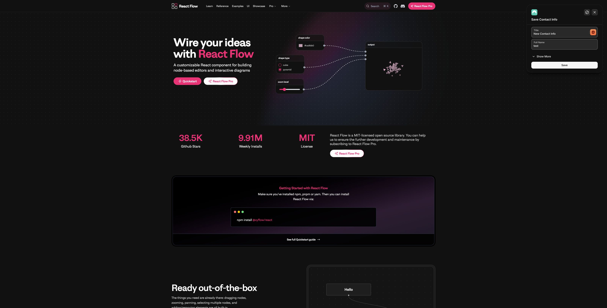

Node-based editor examples on the landing page.

### CentreAI Policy

[Resource note](../initiatives/centreai-policy.md) · [Source](../external-sources/centreai-policy.md)

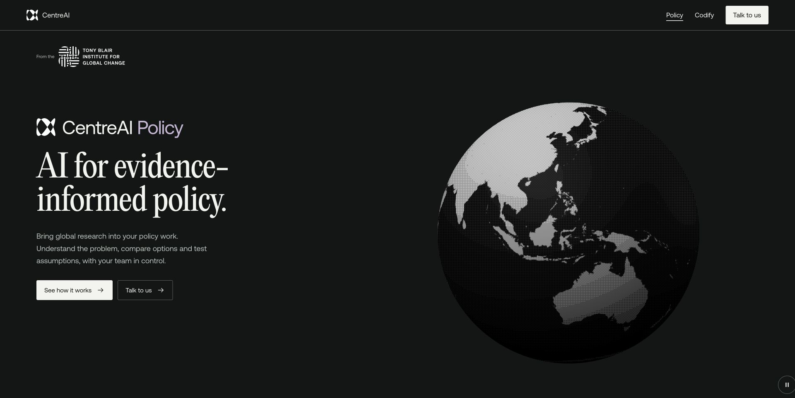

Policy workflow and service introduction.

### UAE ecosystem

[Resource note](../data-sources/uae-ecosystem.md) · [Source](../external-sources/uae-ecosystem.md)

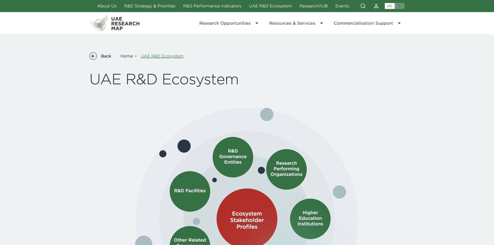

Radial category navigation with incubators selected.

### ResearchHub

[Resource note](../initiatives/researchhub.md) · [Source](../external-sources/researchhub.md)

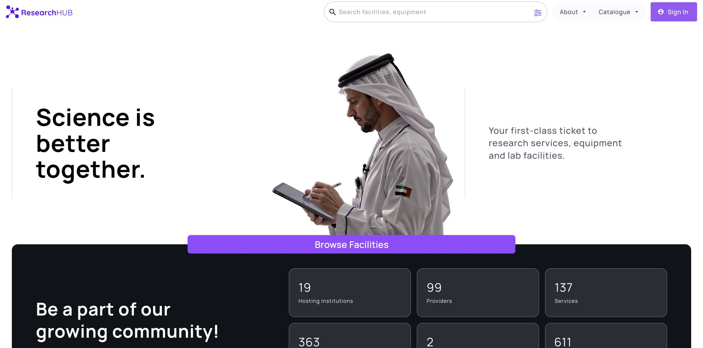

Research-service and equipment discovery.

### SynSapien landing page

[Resource note](../initiatives/synsapien.md) · [Source](../external-sources/synsapien.md)

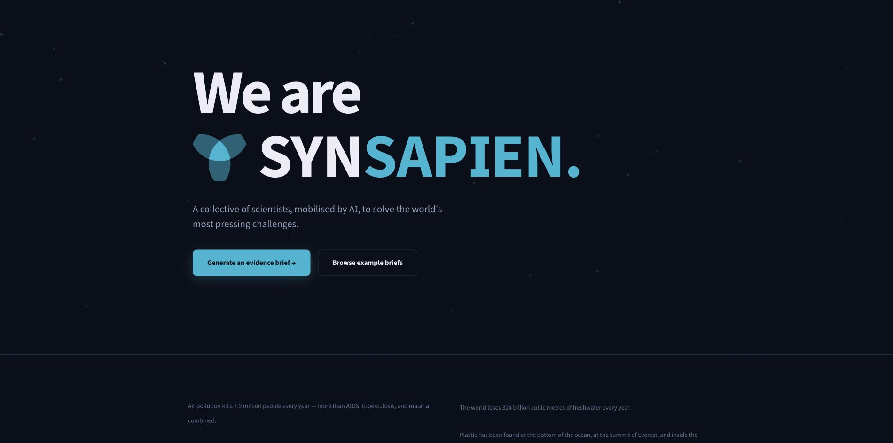

Question-and-context brief form; no job submitted.

### SynSapien examples

[Resource note](../initiatives/synsapien.md) · [Source](../external-sources/synsapien.md)

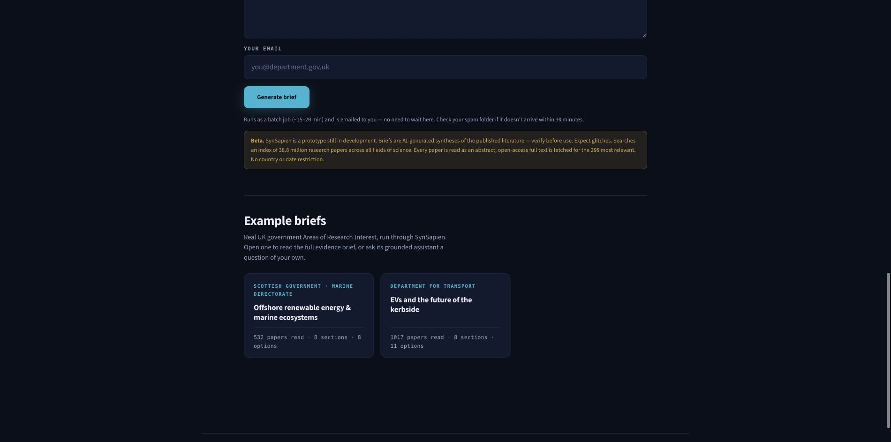

Beta warning and two example brief entry points; child briefs not opened.

### ImpactAI

[Resource note](../initiatives/impactai.md) · [Source](../external-sources/impactai.md)

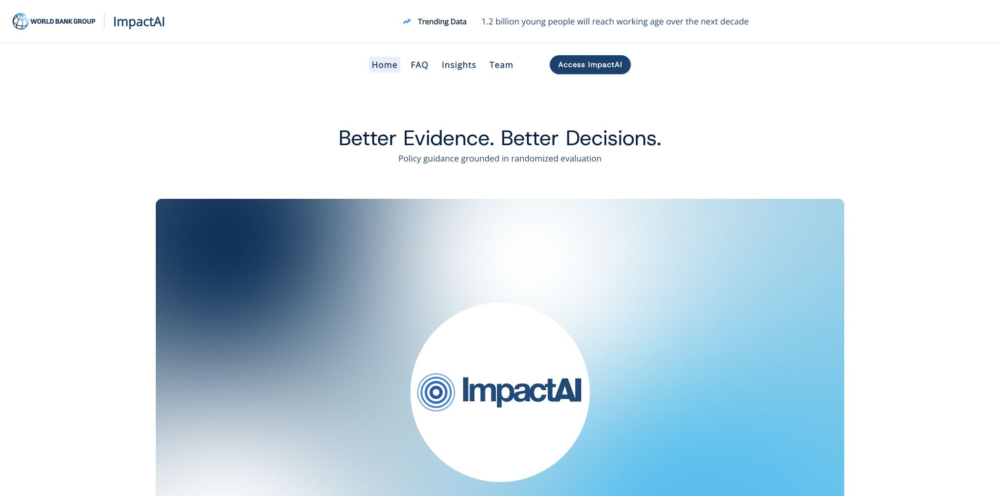

Randomized-evaluation evidence framing.

### INVI method introduction

[Resource note](../methods/invi-model.md) · [Source](../external-sources/invi-model.md)

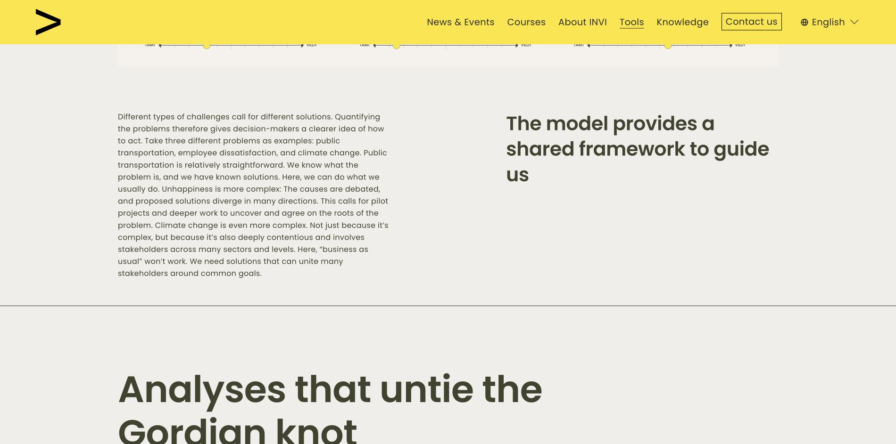

Introductory methodology text, not a complete model output.

### INVI dimensions

[Resource note](../methods/invi-model.md) · [Source](../external-sources/invi-model.md)

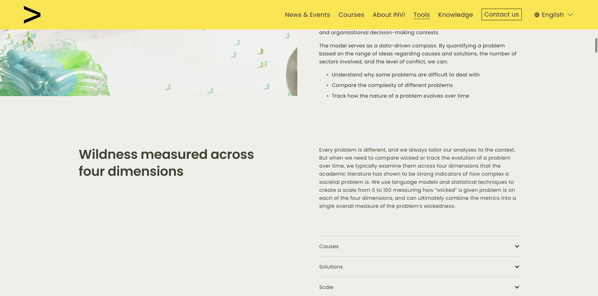

Discussion of four wickedness dimensions.

### Product Space

[Resource note](../data-sources/product-space.md) · [Source](../external-sources/product-space.md)

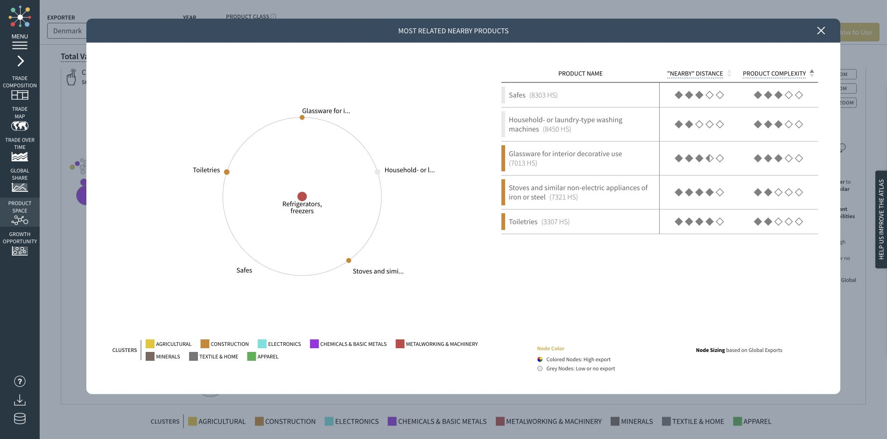

Denmark view with refrigerator detail panel; imports parameter conflicts with export-oriented legend.

### Green research

[Resource note](../data-sources/green-research.md) · [Source](../external-sources/green-research.md)

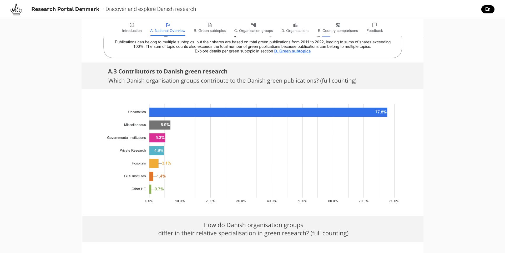

Embedded organizational-group chart with counting context.

### UNDP dashboard

[Resource note](../projects/undp-sensemaking.md) · [Source](../external-sources/undp-sensemaking.md)

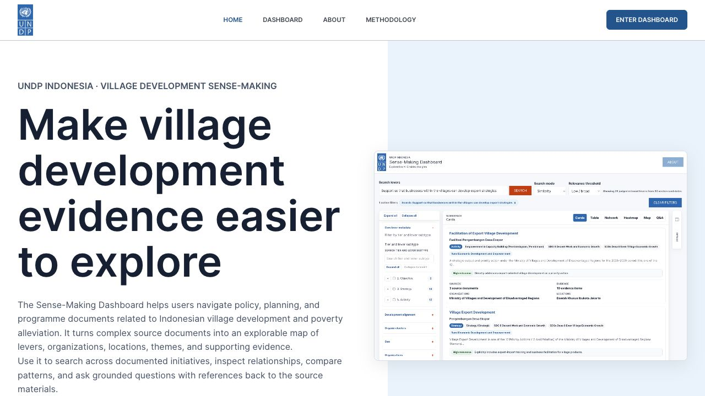

Public project introduction.

### UNDP causal-loop illustration

[Resource note](../methods/causal-loop-diagrams.md) · [Source](../external-sources/causal-loop-diagrams.md)

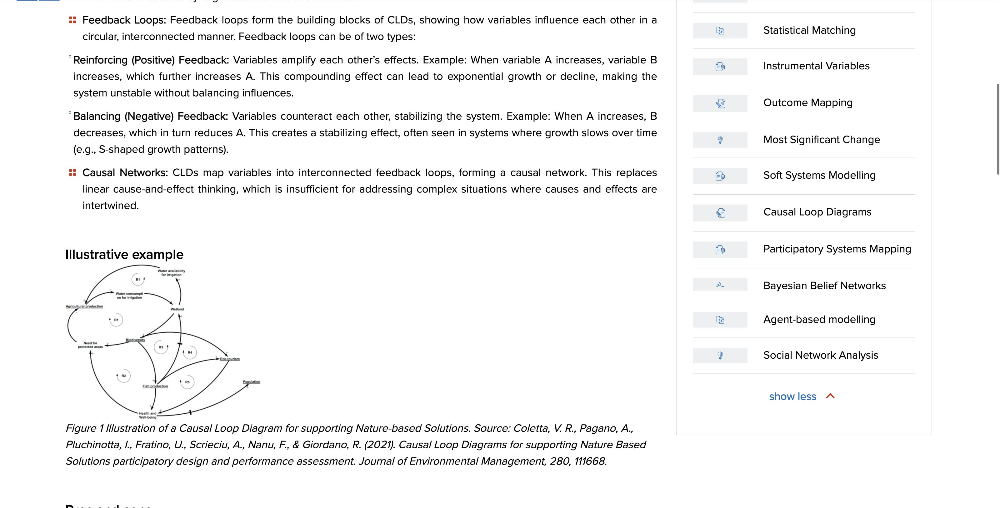

Illustration on the methods page.

## Machine-readable provenance

[Media manifest](../assets/evidence/media-manifest.json) · [PDF checksums](../assets/evidence/pdf-manifest.json). Page renders preserve whole pages so diagrams remain in context. Original source rights apply.

## Sources

[Browse guides](index.md) · [Library home](../index.md)
