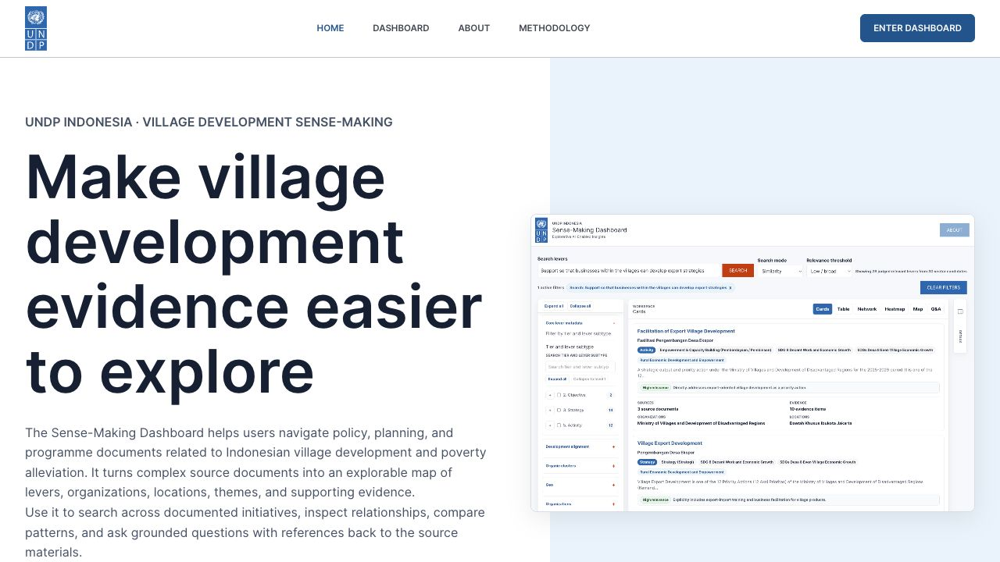

The supplied dashboard describes exploration of policy, planning and programme documents concerning Indonesian village development and poverty alleviation. Its public introduction presents multiple views of themes, actors, locations and relationships.[^s1]

## Start here

1. [Participatory systems mapping](../methods/participatory-systems-mapping.md): bring stakeholder knowledge into interpretation.
2. [Causal loop diagrams](../methods/causal-loop-diagrams.md) and the [illustrated handbook](../readings/causal-loop-handbook.md): distinguish feedback hypotheses from observed relationships.
3. [Policy steering rooms](../methods/policy-steering-rooms.md): organize a shared session around patterns, evidence, innovations and futures.
4. [Contribution analysis](../methods/contribution-analysis.md) and [process tracing](../methods/process-tracing.md): connect claims to mechanisms and evidence.
5. [Policy Synth](../initiatives/policy-synth.md), [INVI](../methods/invi-model.md) and [SynSapien](../initiatives/synsapien.md): compare alternative synthesis and participation approaches.

## Suggested design questions

These are library recommendations, not an approved project roadmap:

- Can users inspect the source behind every extracted relationship?
- Are workshop interpretations distinguishable from document statements?
- Can contradictory perspectives coexist?
- Is a suggested intervention clearly separated from evidence of effectiveness?

## Observed scope

Only the supplied public landing page was reviewed for project context. Its feature descriptions are not a functional audit of all dashboard views.

## Additional reference cases

For design comparison, see [FiskalLink AI](../initiatives/fiskallink.md) for reviewed budget-theme tagging and the [Eryawan projects portfolio](../initiatives/eryawan-projects.md) for adjacent legal and research systems. These are reference cases, not evaluated recommendations or an approved project roadmap.

## Connections

[MinCiencia pathway](minciencia-ctci.md) · [Benchmark comparison](../guides/benchmark-guide.md) · [Method chooser](../guides/method-chooser.md).

## Sources

[^s1]: [Captured source: undp-sensemaking](../external-sources/undp-sensemaking.md).

[Browse projects](index.md) · [Library home](../index.md)
