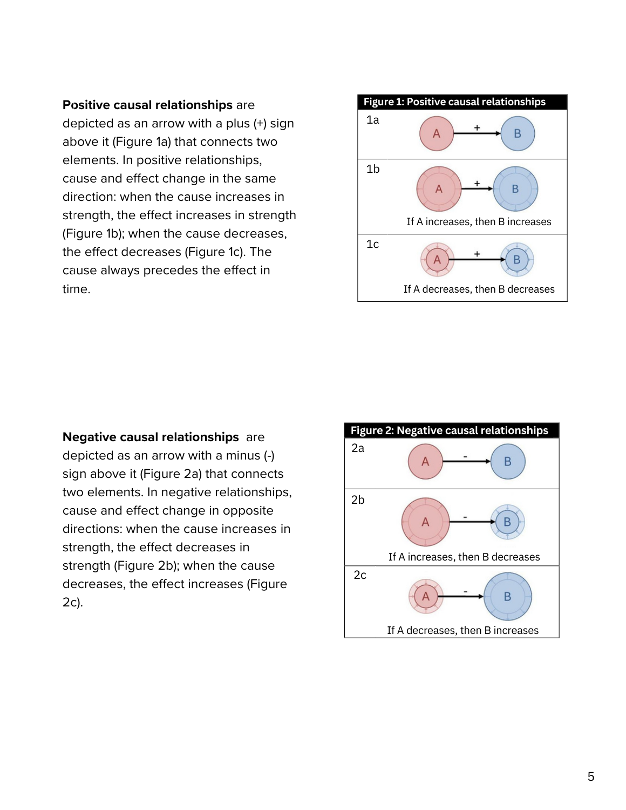
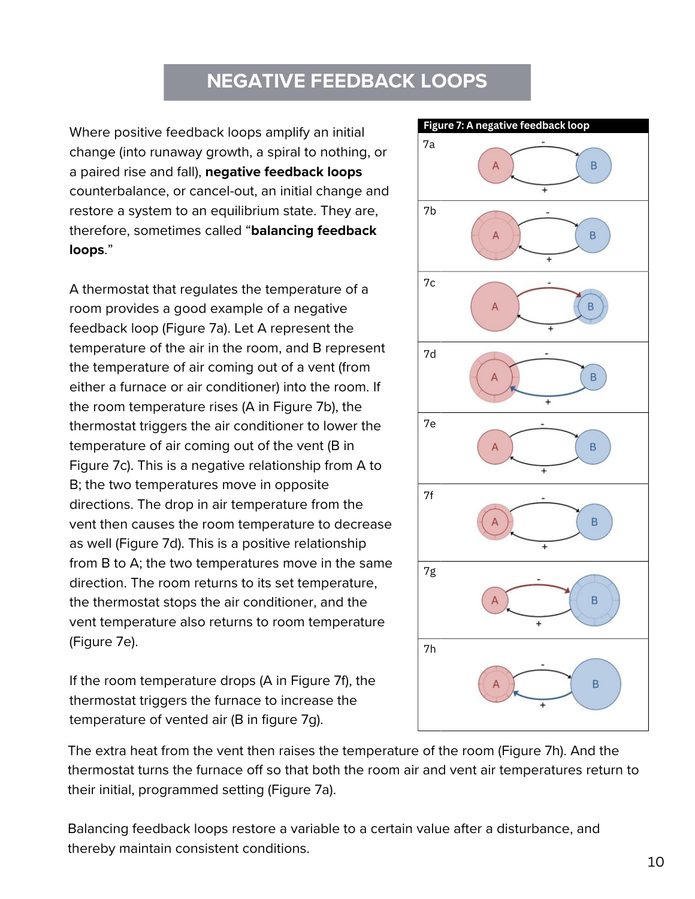
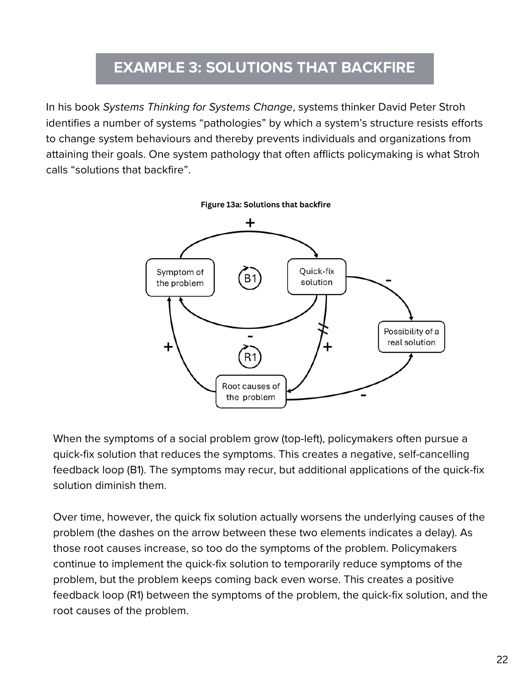

Michael Lawrence's Cascade Institute handbook explains signed relationships, feedback loops and common system archetypes.[^s1] It is a practical companion to [UNDP's method note](../methods/causal-loop-diagrams.md).

[Read the complete local PDF](../external-sources/causal-loop-handbook.pdf) · 24 PDF pages. Page numbers below are one-based PDF positions.

[Searchable text extraction](../external-sources/causal-loop-handbook.txt) — automatically extracted with layout hints; consult the PDF for diagrams, reading order and authoritative wording.

## Visual reading

*Page 5: link polarity describes whether variables move in the same or opposite direction, other things equal.*

*Page 10: the thermostat example helps explain corrective, balancing feedback.*

*Page 22: a solution can introduce feedback that undermines its intended result.*

## Suggested use and limits

Use these examples in a workshop before asking participants to interpret a policy map. They explain diagram logic; they do not validate a particular policy's causal assumptions. Publisher: [Cascade Institute](../organizations/cascade-institute.md).

## Sources

[^s1]: [Captured source: causal-loop-handbook](../external-sources/causal-loop-handbook.md).

[Browse readings](index.md) · [Library home](../index.md)
