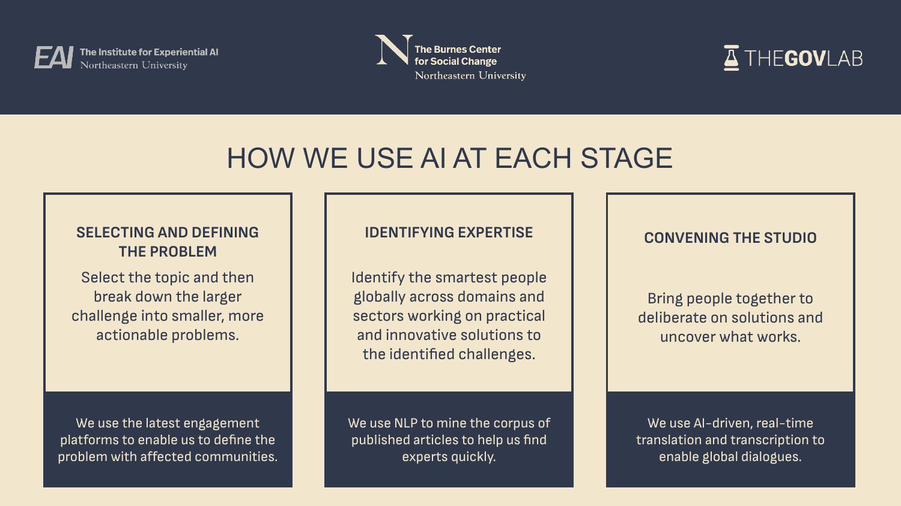
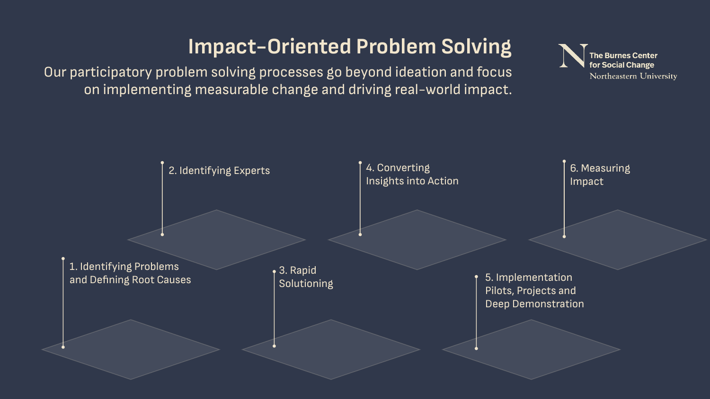
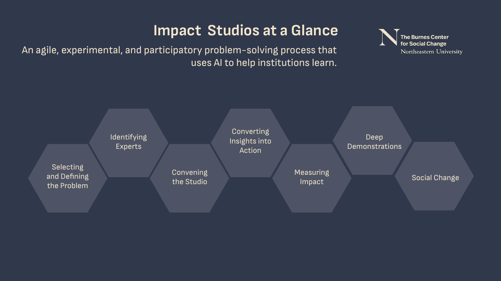

The supplied presentation explains how artificial and collective intelligence can support problem definition, expertise discovery, convening and actionable proposals.[^s1]

[Read the complete local PDF](../external-sources/impact-studios-deck.pdf) · 24 PDF pages. The supplied filename is not treated as a verified publication date.

[Searchable text extraction](../external-sources/impact-studios-deck.txt) — automatically extracted with layout hints; consult the PDF for diagrams, reading order and authoritative wording.

## Visual reading

*Page 6: problem selection, expertise and convening are distinct tasks.*

*Page 8: a process view connects activities across the programme.*

*Page 24: the concluding overview provides a compact visual reference.*

## Suggested use and limits

Useful for designing a facilitated engagement around either project. It is explanatory programme material, not an independent impact evaluation. See [Impact Studios](../initiatives/impact-studios.md), [Burnes Center](../organizations/burnes-center.md) and [The GovLab](../organizations/govlab.md).

## Sources

[^s1]: [Captured source: impact-studios-deck](../external-sources/impact-studios-deck.md).

[Browse readings](index.md) · [Library home](../index.md)
