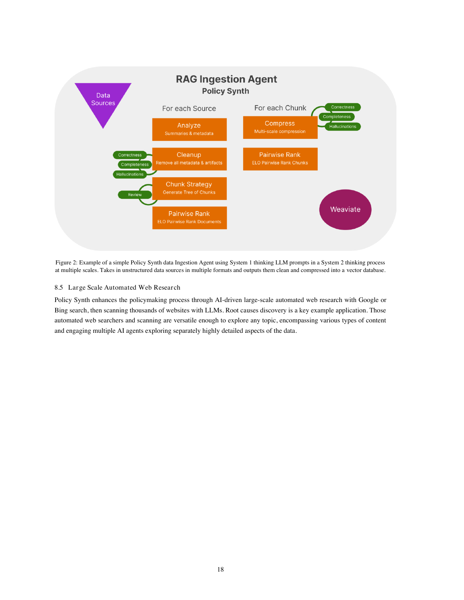
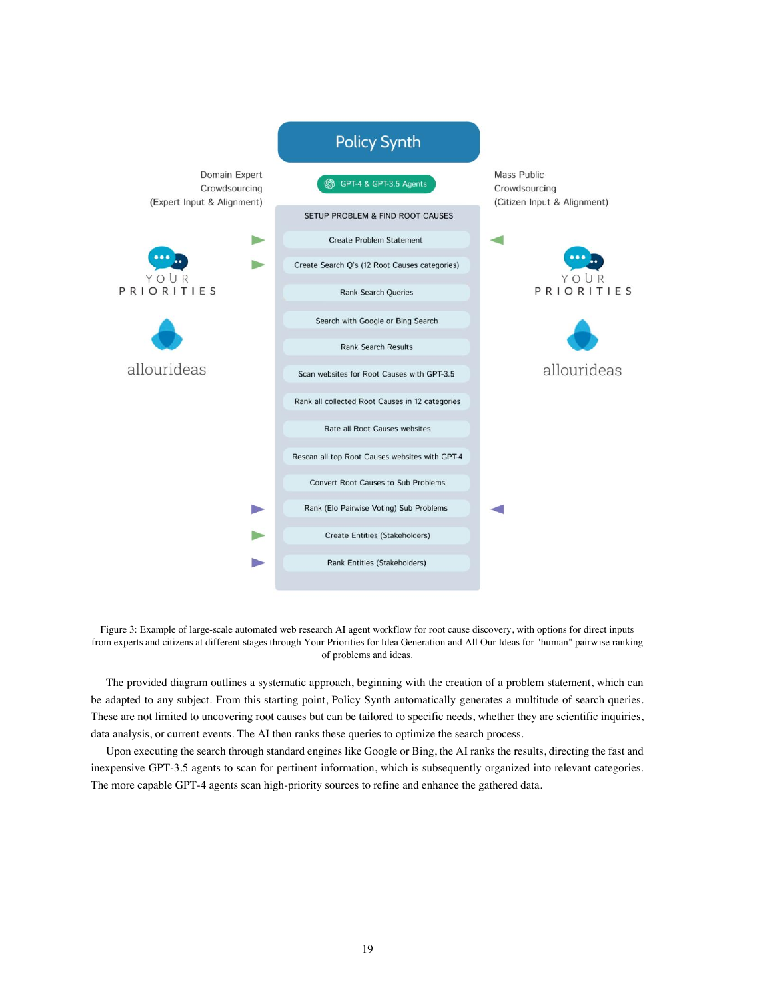
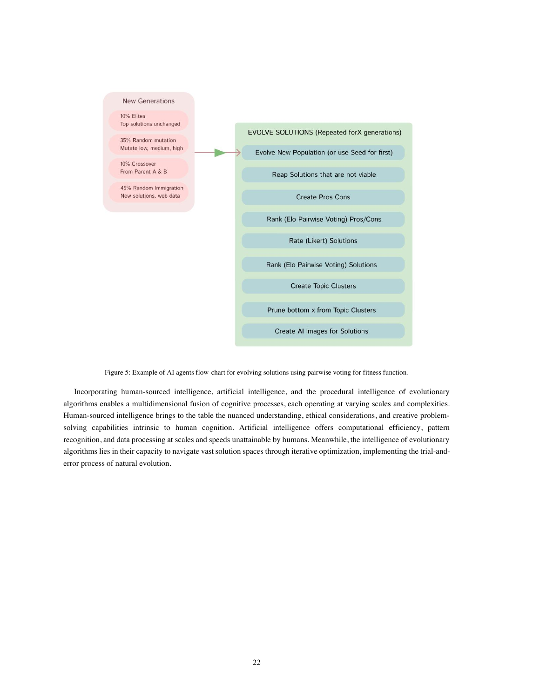

Róbert Bjarnason, Dane Gambrell and Joshua Lanthier-Welch describe combining AI and collective intelligence through Policy Synth and Smarter Crowdsourcing.[^s1]

The paper includes a comparison of 65 AI-generated solutions with 14 human recommendations. Its LLM-assisted assessment concerns overlap or coverage; it is not a randomized demonstration of better policy outcomes.

[Read the complete local PDF](../external-sources/policy-synth-paper.pdf) · 51 PDF pages.

[Searchable text extraction](../external-sources/policy-synth-paper.txt) — automatically extracted with layout hints; consult the PDF for diagrams, reading order and authoritative wording.

## Visual reading

*Page 18: staged intake and processing make intermediate work visible.*

*Page 19: research and problem analysis are represented as distinct operations.*

*Page 22: candidate solutions are developed and assessed iteratively.*

## Suggested use

Compare these stages with a prospective workflow for evidence review and policy options. Preserve evaluation criteria and human review points. See the [initiative](../initiatives/policy-synth.md), [software](../software/policy-synth.md) and [Smarter Crowdsourcing method](../methods/smarter-crowdsourcing.md).

## Sources

[^s1]: [Captured source: policy-synth-paper](../external-sources/policy-synth-paper.md).

[Browse readings](index.md) · [Library home](../index.md)
